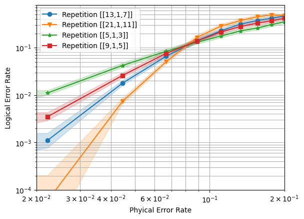

# Graph QEC

[](https://opensource.org/licenses/Apache-2.0)

**Graph QEC** is a Python package under development that provides tools for implementing **Quantum Error Correction Codes (QECC)** by constructing their **Tanner Graphs**, automatically compiling them into **[Stim](https://github.com/quantumlib/Stim)** circuits, and computing error correction thresholds. This package allows researchers and developers to explore quantum error correction techniques, simulate quantum codes under gate error models, and analyze their performance through error thresholds.

## Features

- **Tanner Graph Representation**: Visualize and analyze quantum error correction codes through Tanner graphs, a graphical representation that simplifies the understanding of code structure and error syndromes.
- **Stim Circuit Compilation**: Automatically compile Tanner graphs into **Stim** circuits, enabling easy integration with simulation tools for error correction and noise analysis.
- **Threshold Computation**: Compute and analyze the error threshold of a quantum code, which indicates the error rate at which the code remains fault-tolerant.

## List of Implemented QEC Codes

- **[Repetition Code](notebooks/repetition_code.ipynb)**
- **[Shor Code](#)** (**in progress**)
- **[Rotated Surface Code](notebooks/rotated_surface_code.ipynb)**
- **[Bivariate Bicycle Code](#)** (**in progress**).

## Installation

Since **Graph QEC** is not yet available on PyPI, you can install it by cloning the repository directly from GitHub:

1. Clone the repository:

   ```bash
   git clone https://github.com/adelshb/graphqec
   cd graphqec

2. You can then install the package by running:

   ```bash
   pip install .

This will install the package in your local environment. Once installed, you can use it to generate Tanner graphs, compile Stim circuits, and compute error thresholds.

## Basic Usage

### Visualizing the graph

```py
from graphqec import RotatedSurfaceCode

# Initializaze the graph
rot = RotatedSurfaceCode(distance = 5)

rot.draw_graph()
```


### Accessing Stim circuit

```py
from graphqec import RepetitionCode

# Initializaze the graph
rep = RepetitionCode(
    distance = 5,
    depolarize1_rate = 0.05,
    depolarize2_rate = 0.05
)

# At this stage the Stim circuit is built
rep.build_memory_circuit(number_of_rounds=2)
rep.memory_circuit.diagram()
```

### Running a threshold computation

```py
from graphqec import RepetitionCode, ThresholdLAB

th = ThresholdLAB(
    configurations = [{"distance": d} for d in [3, 5, 7, 11]],
    code = RepetitionCode,
    error_rates = np.linspace(0, 0.2, 10),
    decoder='pymatching'
)

th.collect_stats(
    num_workers = 4,
    max_shots = 10**5,
    max_errors= 1000
)

th.plot_stats(
    x_min = 2e-2,
    x_max = 2e-1,
    y_min = 1e-4,
    y_max = 8e-1
)
```



## Contributing

Pull requests and issues are more than welcomed. We welcome contributions from anyone. Please visit **[CONTRIBUTING.md](CONTRIBUTING.md)** for details.

## License

**[Apache License 2.0](LICENSE)**
